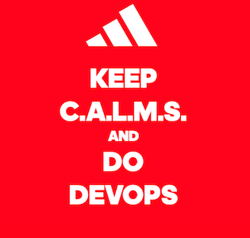

 

# adidas DevOps Maturity Framework

The DevOps maturity framework was created by adidas as a guide for the first DevOps cup to support
the teams on their DevOps transformation journey.

Based in the C.A.L.M.S. definition of DevOps, the framework defines a set of capabilities and 
guidelines that when adopted, increases efficiency (speed, cost...), effectiveness (quality...)
and happiness of the team.

* <b>C</b>ulture
* <b>A</b>utomation
* <b>L</b>ean
* <b>M</b>easurement
* <b>S</b>haring

### Motivation

The framework defines maturity levels for each capability that teams can use to self-assess their 
current maturity and understand what needs to be done to go to the next level. 

As practitioners Lean practitioners our framework is in continuous evolution and the "Run" of today 
might be the "Walk" of tomorrow, helping the teams to aim for continuous improvement.

### Contents

* [DevOps Maturity Framework](framework/devops_maturity_framework.md)
* [DevOps Maturity Increase Index (DMII)](framework/dmii.md)

### Questions & Comments

_Please contact_ [_Ignacio.Alzorriz@adidas-group.com_](mailto:Ignacio.Alzorriz@adidas-group.com), [_Josemaria.Puyal@adidas.com_](mailto:Josemaria.Puyal@adidas.com) or [_Juan.Civeira@adidas.com_](mailto:Juan.Civeira@adidas.com) _in case of questions._

## License and Software Information

© adidas AG

adidas AG publishes this software and accompanied documentation (if any) subject to the terms of the MIT license with the aim of helping the community with our tools and libraries which we think can be also useful for other people. You will find a copy of the MIT license in the root folder of this package. All rights not explicitly granted to you under the MIT license remain the sole and exclusive property of adidas AG.

NOTICE: The software has been designed solely for the purpose of analyzing the code quality by checking the coding guidelines. The software is NOT designed, tested or verified for productive use whatsoever, nor or for any use related to high risk environments, such as health care, highly or fully autonomous driving, power plants, or other critical infrastructures or services.

If you want to contact adidas regarding the software, you can mail us at _software.engineering@adidas.com_.

For further information open the [adidas terms and conditions](https://github.com/adidas/adidas-contribution-guidelines/wiki/Terms-and-conditions) page.

### License

[MIT](LICENSE)