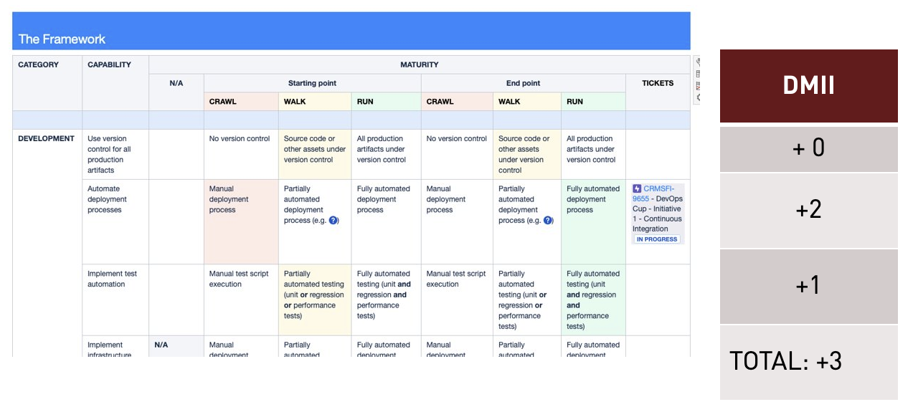

# DevOps Maturity Increase Index (DMII)

The DevOps maturity increase index is used to measure the number of maturity levels that are 
targeted to increase during a particular improvement cycle. 

> DMII calculation example
 

Due to the constant changes in the products (imagine you develop a new component in your product and 
it is not integrated with your CICD pipeline,...), technologies and even the definition of the maturity 
levels as they evolve, the DMII could be negative.

### Linking the changes to the generated business value
It is not only about identifying the changes we want to introduce, but it is also very important to link 
those changes to the generated value, this will allow to open a conversation with the Product Owner 
on why these changes are needed and the need of this changes.

>DMII linked to business value example

DMII Value | Actions | Generated Value   
---------- | ----- | ----
<b>+3</b> | Implement Jenkins code CICD pipelines for fully automated deployments +2    Implement test automation +1  | <b>Increased consumer satisfaction (↑ ↑ NPS)</b>   * Reduced number of incidents   * Reduced downtime with quick detection of performance problems   * Reduced number of defects   * Improved engineering & operations processes (through full traceability of versions and issues) 
   
